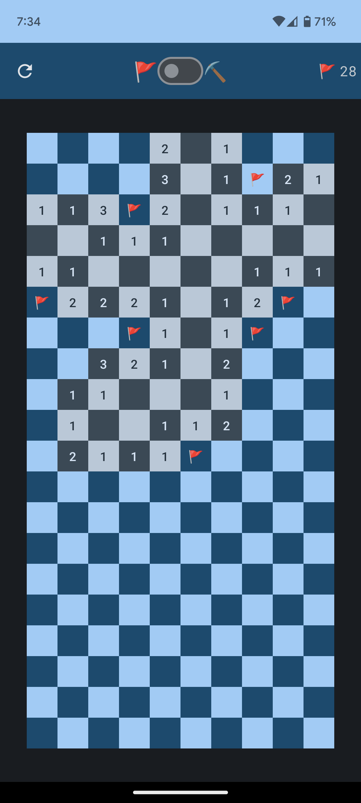
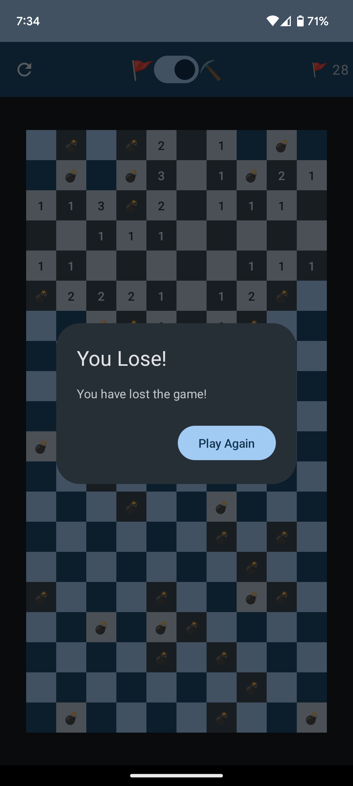

# MinesweeperJCompose

This is a Minesweeper game written in Kotlin using Jetpack Compose.

 

Some cool features:
- MVVM architecture
- Material3 Dynamic Color
- Predictive back gesture

TODO:
- Make the game board configurable
- Add a timer
- Allow non portrait orientation
- Improve performance
- Replace emojis with icons
- Custom app icon
- Allow the user to make some mistakes
- Add hints
- Add Konfetti
- Add vibration
